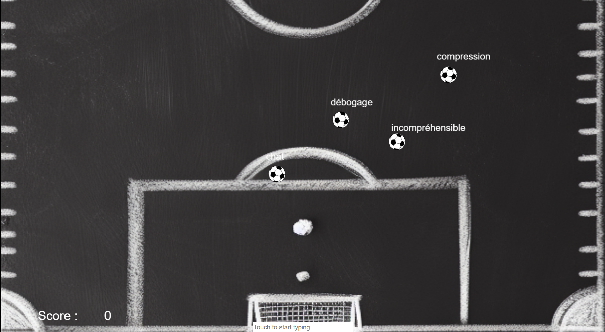

## 🎮 Partie 1 : Mapping et Liste des Assets 📋
Pour cette première étape de développement, nous allons nous concentrer sur la collecte et l'organisation des éléments qui composeront notre jeu de dactylographie. Voici la liste des assets indispensables :

>TextInput 🖊️ : Un champ de saisie de texte où les joueurs entreront les mots associés aux objets attaquants. Il est crucial que cet élément soit bien visible et ergonomique.
>
>EnemyWord 🆚 : Les mots qui doivent être tapés par le joueur pour "détruire" ou repousser les objets ennemis. Chaque mot sera attaché à un objet ennemi spécifique.
>
>Objet de référence à l'ennemi (par exemple, ballon de foot) 🎈: Représente visuellement l'ennemi dans le jeu. Cet objet doit être dynamique et visuellement distinct pour que le joueur puisse facilement l'identifier et réagir.
>
>Fond d'écran du jeu 🌅 : L'illustration de fond qui habille le jeu, créant l'atmosphère désirée. Le choix du fond influencera l'immersion du joueur dans le monde du jeu.
>
>Objet ou animation pour détruire/renvoyer les objets ennemis 💥 : Un effet visuel ou une animation qui se déclenche lorsque le joueur tape correctement le mot associé à un ennemi. Cela peut varier d'une simple animation d'explosion à des effets plus complexes selon le thème du jeu.
>
>Base du joueur 🏰 : L'élément que les ennemis essaient d'atteindre et que le joueur doit protéger. La conception de cet objet doit clairement indiquer son importance et son rôle dans le jeu.

Le choix et la conception de ces assets sont cruciaux car ils contribuent non seulement à l'esthétique globale du jeu, mais aussi à son gameplay. Il faudra veiller à ce qu'ils soient cohérents avec le thème du jeu et qu'ils contribuent à une expérience ludique et engageante.

