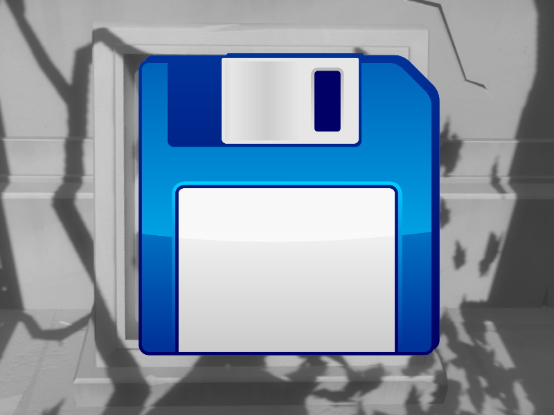
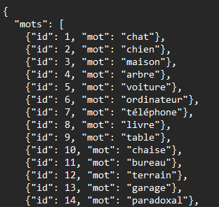
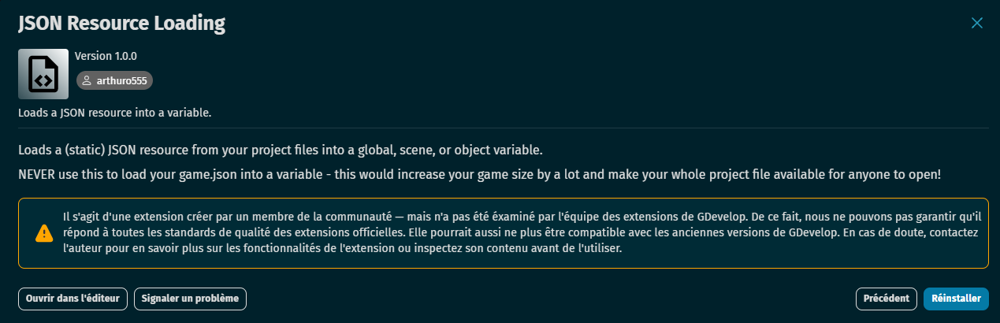

# 📚 Partie 2 : Introduction au JSON et Création du Dictionnaire des Mots 📄
L'utilisation du format JSON (JavaScript Object Notation) est cruciale dans le développement de jeux pour organiser et manipuler des données. Dans cette partie, tu apprendras à créer et utiliser un dictionnaire de mots en JSON, un élément clé pour le gameplay de ton jeu de dactylographie.

### L'Importance des Fichiers JSON dans les Jeux Vidéo 🎮📁
Les fichiers JSON, grâce à leur structure légère et facilement interprétable tant par les humains que par les machines, jouent un rôle crucial dans le développement des jeux vidéo, notamment dans la gestion des sauvegardes de données et dans la configuration de divers aspects du gameplay.

## Sauvegardes de Données 📈
Les sauvegardes de données de jeu sont essentielles pour permettre aux joueurs de reprendre leur partie là où ils l'ont laissée. Grâce à JSON, on peut stocker efficacement des informations telles que le niveau du joueur, les ressources collectées, les équipements acquis, et d'autres données de progression. La flexibilité de JSON facilite la mise à jour et la récupération de ces données, contribuant à une expérience utilisateur fluide et agréable.

## Dictionnaire de Mots pour Ennemis 🗒️
Dans le contexte de ton projet, l'utilisation d'un fichier JSON pour créer un dictionnaire de mots associés aux ennemis est une excellente idée. Ce dossier servira de référence pour générer dynamiquement des défis verbaux que les joueurs devront relever pour vaincre les ennemis ou progresser dans le jeu.

## Création d'un Dictionnaire de Mots en JSON 📖
Pour mettre en œuvre cette idée, tu dois procéder comme suit :

1. Créer ton fichier JSON : Débute par la création d'un fichier JSON. Nomme-le de manière appropriée, par exemple WordsDictionary.json.

2. écrit tes permier mots que tu souhaite retrouvé a l'interieur de ton jeu tout en suivant cette structure. 

3. Place ton fichier dans les Assets de ton projet Gdevelop.📁
   
## Intégration du Fichier JSON dans GDevelop 🎮💾

Pour rendre l'utilisation du dictionnaire de mots fluide et performante dans GDevelop, l'étape cruciale est de charger le fichier JSON en tant que structure de données accessible pendant le jeu. Voici comment procéder :

1. Création de Variables de Scène 📊 : Commence par créer des variables de scène dans GDevelop. Tu auras besoin d'une variable Mots de type structure pour stocker les données de ton dictionnaire JSON, et une variable ID de type nombre qui pourrait servir à identifier les mots ou pour toute autre fonctionnalité requise par ton gameplay.

2. Charger le Fichier JSON 📂 : Au début de la scène, utilise une action pour charger ton fichier JSON directement dans la variable de scène Mots. Ceci peut être réalisé grâce à la fonction "Load JSON from a file" ou une approche similaire disponible dans GDevelop, adaptée au chargement et à la manipulation de données JSON. Si vous ne trouvez pas vous avez sûrement besoin de cette extension a télécharger

   

3. Vérification : vérifie que tout fonctionne en lançant ton projet avec le debogueur et sur l'écran du debogueur vérifie que tes variables sont toute présente et ne soit pas nommé "0".

Cette méthode permet une integration fluide et efficace de données JSON dans ton jeu GDevelop, améliorant ainsi l'expérience globale pour les joueurs en leur offrant des défis verbaux variés et dynamiques.

Fort de notre voyage à travers les mystères du JSON et la création d'un riche dictionnaire de mots, nous avons armé notre jeu d'une dimension éducative et interactive captivante. 🌟💡 Notre parcours nous a enseigné comment donner vie et sens à chaque mot, créant ainsi un lien profond entre le joueur et l'univers du jeu.

À présent, il est temps de passer à la phase suivante, un chapitre alliant finesse technique et créativité artistique : "Création des Ballons" 🎈🛠️. Dans cette nouvelle aventure, nous allons explorer la création d'objets dynamiques qui seront les vecteurs de notre gameplay éducatif.

Préparez-vous à donner une nouvelle dimension à votre jeu, où la programmation se mêle à l'art pour créer une expérience immersive et ludique. Embarkons ensemble pour ce nouveau chapitre, prêts à gonfler nos ballons de connaissances, de défis et de créativité. 🚀🎨
[3.Création Des Ballons.md](https://github.com/g404-code-gaming/TypingGame/blob/main/Création-Du-Jeu/3.Création%20Des%20Ballons.md)

