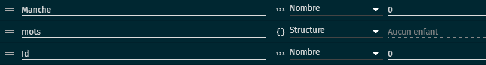
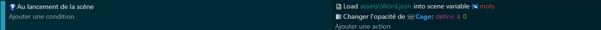
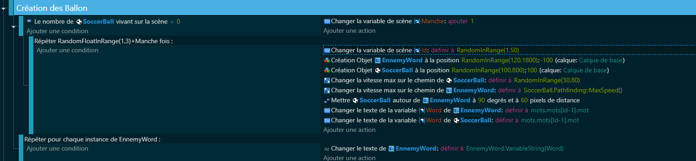
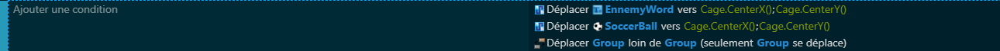

# 3.Création Des Ballons 👾💥🎮

Dans cette section, tu vas apprendre à créer des ennemis débordants de caractère dans GDevelop, liés aux défis verbaux issus de notre super dictionnaire de mots. Prépare-toi à rencontrer des créatures aussi diverses que colorées et à les intégrer dans une aventure palpitante.

## Déclaration des Variables et Comportements 📚🔧
Dans cette première étape, on se concentre sur les bases pour préparer le terrain en définissant nos acteurs principaux et les règles du jeu.

### Déclarations des Variables :
Variables de Scène : Crée une variable de scène Mots qui va contenir notre dictionnaire sous forme de structure pour les mots à utiliser pendant le jeu. Ajoute aussi une variable de scène ID, de type nombre, qui servira à sélectionner un mot de manière aléatoire. Puis enfin une variable manche qui déterminera le nombre d'ennemis qui apparaîtront durant la manche.

Variables des objets EnnemyWord + soccerBall (votre ennemi) : Ajoutez une variable Word de type chaîne de caractères qui correspondra au mot à écrire pour tuer votre ennemi.

### Comportements :
SoccerBall et EnnemyWord : Ces objets représenteront physiquement les ennemis dans le jeu. Leur mouvement et interaction dans l'espace de jeu sont dictés par le comportement de pathfinding (cheminement).

## Code et Mise en Pratique 🎮💻
Maintenant que les préparatifs sont terminés, il est temps de mettre les mains dans le code, de créer des interactions dynamiques et de voir notre jeu prendre vie.

### Au Démarrage de la Scène :
Chargement du Dictionnaire : Au début de la scène, on charge le fichier JSON contenant les mots dans la variable de scène Mots. Cela nous permet d'avoir accès à une sélection variée de mots tout au long du jeu.

### Création Dynamique des Objets :
Quand il n'y a aucun SoccerBall dans la scène, cela déclenche la création d'objets EnnemyWord et SoccerBall à des endroits et avec des vitesses aléatoires. Chaque objet aura un ID associé qui permet de lui attribuer un mot spécifique de la structure Mots.

### Déplacement des Objets :

#### Noeuds de Destination EnnemyWord et SoccerBall 🎯
Imagine un "bloc" appelé Destination, où EnnemyWord et SoccerBall pointent vers le centre de la Cage. C'est comme donner à chaque objet ennemi une boussole qui indique où se trouve le but, les guidant directement vers le centre de la Cage.

#### Noeud de Séparation Group 🚀
Ensuite, considère un "bloc" de Séparation où les objets évitent de se superposer en restant à distance les uns des autres. Cela aide les objets à maintenir un espace personnel, évitant ainsi la congestion autour du but (Cage).

## Conclusion

Nous voilà arrivés au terme de ce chapitre passionnant sur la Création des Ballons 🎈🏀 dans ton aventure GDevelop. Tu as découvert comment peupler ton jeu d'ennemis 🤖 hauts en couleur, liés par la magie des mots 📚✨, depuis la déclaration des variables essentielles 🗝️, jusqu'à la mise en place de comportements dynamiques 🌀 et l’intégration de ces concepts dans le flux logique 🌊 de ton jeu. 🎉

Ce parcours 🛤️ t'a préparé à franchir la prochaine étape cruciale : le Système de Vérification des Mots 🔍🔐.

Allons découvrir ensemble comment transformer chaque mot en un véritable défi 🏆, en cliquant [le Système de Vérification des Mots](#).

Prends une grande inspiration 😤 et sois prêt à embarquer dans cet excitant voyage 🚀 au cœur de GDevelop. L'aventure continue! 🌠
