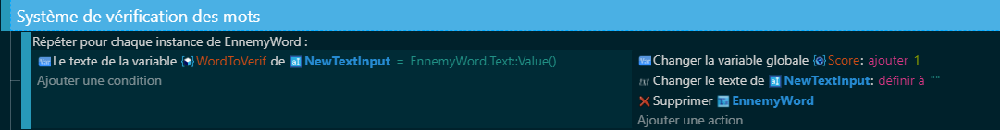
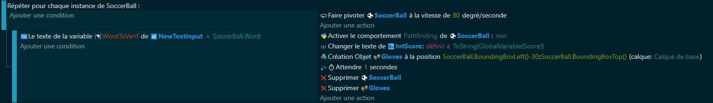
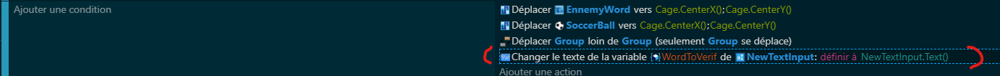

# 4.le Système de Vérification des Mots📄🔍
## Introduction 🚀
Bienvenue dans le chapitre vibrant sur le "Système de Vérification des Mots" 🎮📝 pour ton jeu sur GDevelop ! Ici, nous allons découvrir comment donner vie à l'interaction joueur-jeu grâce à la magie des mots justes. Préparez-vous à plonger dans un mix de logique de programmation et de créativité pour enrichir votre jeu ! 

## Déclaration des Variables 🔠🎛️
Avant de nous lancer, organisons notre atelier avec quelques outils essentiels - nos variables :

Variable globale Score 🌟: Elle va enregistrer les points du joueur, marquant chaque mot correct un triomphe !

Variable d'objet WordToVerif 📄: Celle-ci va capturer les mots tapés par nos joueurs, prêts pour le test ultime contre nos ennemis lexicaux !

Avec ces variables clés, on est parés pour faire danser nos mots !

##  Le Code 🔍💡
C'est l'heure de plonger dans le cœur pulsant de notre chapitre, là où les mots deviennent action :

### Pour EnnemyWord 👾:
À travers une boucle ForEach, chaque ennemi mot est scruté.
Un match mot à mot peut transformer le score 💥, effacer les traces du champ de texte 🧽, et éliminer l'ennemi du terrain 🚫.

### Manœuvre des SoccerBall ⚽:
Chaque sphère se met à tourner, ajoutant du panache à notre scène.
Si le joueur marque un but lexical, on active une belle chorégraphie : mise à jour score 🔄, apparition des Gloves comme trophée 🏆 et sortie de scène des objets ⏳.

### Completion de WordToVerif 📄:

Ici, nous récupérerons le texte que les joueurs vont écrire pour la stocké dans une variable.

Avec ces pas de danse logiques, on cherche à charmer nos joueurs et à leur proposer un défi incessant.

## Conclusion 🌈✨
En intégrant ce Système de Vérification des Mots, ta quête de développeur de jeu éducatif vient de s'enrichir ! Ce mécanisme ajoute une couche d'interaction joyeuse 🎉 et transforme l'apprentissage en une aventure ludique 🏰.

Et voilà, nous avons franchi ensemble les méandres de la vérification des mots, transformant chaque saisie en une porte vers le succès 🚪🏆. Mais comme dans toute grande aventure, notre périple touche à sa fin. Préparez-vous à aborder la dernière étape cruciale : [**"Fin du jeu + affichage du score"** 🎬📊](https://github.com/g404-code-gaming/TypingGame/blob/main/Création-Du-Jeu/5.Fin%20du%20jeu%20%2B%20affichage%20du%20score.md).

Dans ce prochain et dernier chapitre, nous allons voir comment clore notre jeu avec panache, en offrant aux joueurs une conclusion digne de leur engagement.

On y va ? Préparez-vous à mettre un point final épique à votre création avec GDevelop ! 🚀👾

