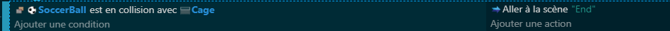
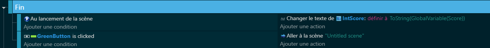
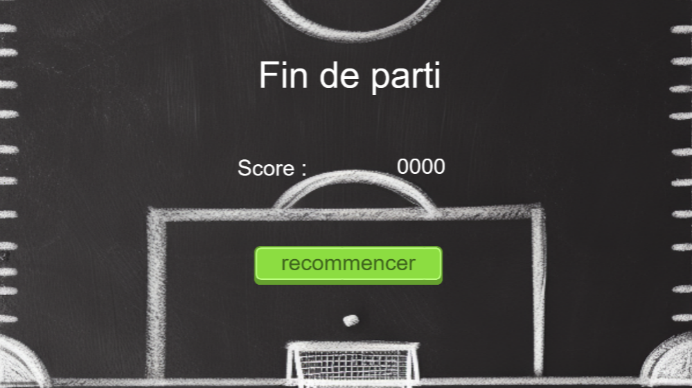

# 5.Fin du jeu + affichage du score

## Introduction 🚩
Vous êtes sur le point de franchir la ligne d’arrivée ! Dans ce dernier chapitre, nous mettrons en place l'acte final de votre jeu : l'écran de fin qui vient couronner votre aventure ludique. Non seulement nous apprendrons comment basculer vers cet écran, mais nous veillerons aussi à ce que chaque joueur puisse apprécier pleinement ses réalisations grâce à un affichage personnalisé du score. 🌟📊

## Implémentation de la Fin de Jeu ✨🏆
### Le Code 💻:

Votre mission sera de coder la transition vers l'écran de fin dès qu'un certain événement - comme la collision avec un objet spécifique (dans notre cas, SoccerBall avec Cage) - se produit. Ce moment charnière détermine la conclusion de votre jeu, envoyant les joueurs vers une nouvelle scène nommée "End".

### Affichage du Score et Boucle de gamplay :

Mais ce n'est pas tout ! Il s'agit également de mettre en lumière les efforts du joueur en affichant son score. Pour cela, vous récupérerez la variable globale Score et l'intégrerez à cette nouvelle scène. Le défi ici sera de créer une interface utilisateur (UI) stylée à votre sauce 🍽️🎨, où le score sera le héros de l'écran de fin.

## Créativité et Personnalisation 🎨🖌️
Encouragez votre créativité ! L'UI de l'écran de fin est votre toile : couleurs, polices, animations... chaque élément peut être pensé pour refléter l'essence de votre jeu et offrir une expérience de clôture mémorable à vos joueurs. Laissez libre cours à votre imagination pour que ce dernier chapitre laisse une empreinte indélébile.

## Conclusion 🚪👋
Vous avez maintenant toutes les clés en main pour orchestrer une fin captivante à votre jeu. L'affichage du score est un acte de reconnaissance des efforts du joueur, un dernier lien avant de se quitter sur une note positive et encourageante. 🌈

Cet écran n'est pas juste une fin ; il est le reflet des aventures vécues, des défis relevés et des succès célébrés. Alors, faites-en un moment spécial, et que votre jeu soit une source d'inspiration et d'émotion pour ceux qui le parcourent. Bonne création ! 🛠️💖
